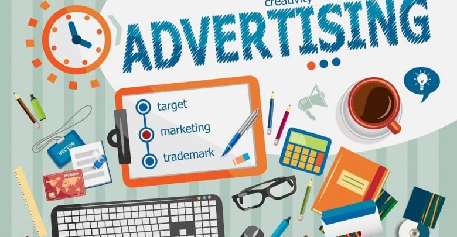

### [Project 4: Advetising agency users behavior prediction](https://github.com/Aellawah/Advetising-agency-users-behavior-prediction/blob/main/Advertising%20agency%20dataset.ipynb)

In this project we will be working with an advertising data set, We are trying to enhance the criteria of the customers that we target with our ads so based on specific features about our customers such as Age,income,city,Gender,.. and other features We will create a model that predicts whether or not they will click on an our ads.

* I created a classification model that predicted who are the most likely customers to click on our ads (with 95% accuracy)
# Code and Resources Used

**Python Version:** 3.7

**Packages:** Pandas,numpy,sklearn,matplotlib,seaborn

# Data Cleaning:

* After wrangling our data we found was some outliers in 'Area income' column which we removed them to enhance our model
* Data had no null values nor duplicated rows
* Types of data columns seemed consistent

# EDA:

General observations:

* I have noticed that older people tend to click more on our ads than youth
* The more the time people spend on internet the likely they click on our ads
* The more the person gets old the less income he gets
* I have fitted our data on a Logistic Regression model and Decision tree classification model

Correlated features:

1. Daily time spent on site and Daily internet used is moderally correlated(0.52)
2. Age and click on AD are moderally correlated (0.49)

# Model Building:

* I have used two classification machine learning models and both of them gave me a good accuracy levels (Logistic regression,Decision Tree classifier)
* Logistic Regression Classification report showed that the f1 score of the model is 92% 
* Decision Tree Classifier Classification report showed that the f1 score of the model is 92% also
